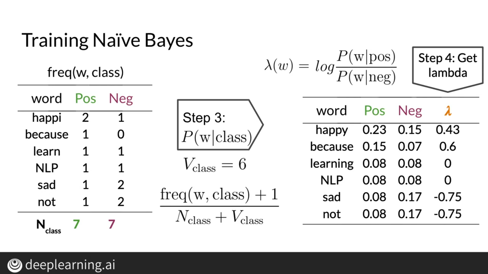
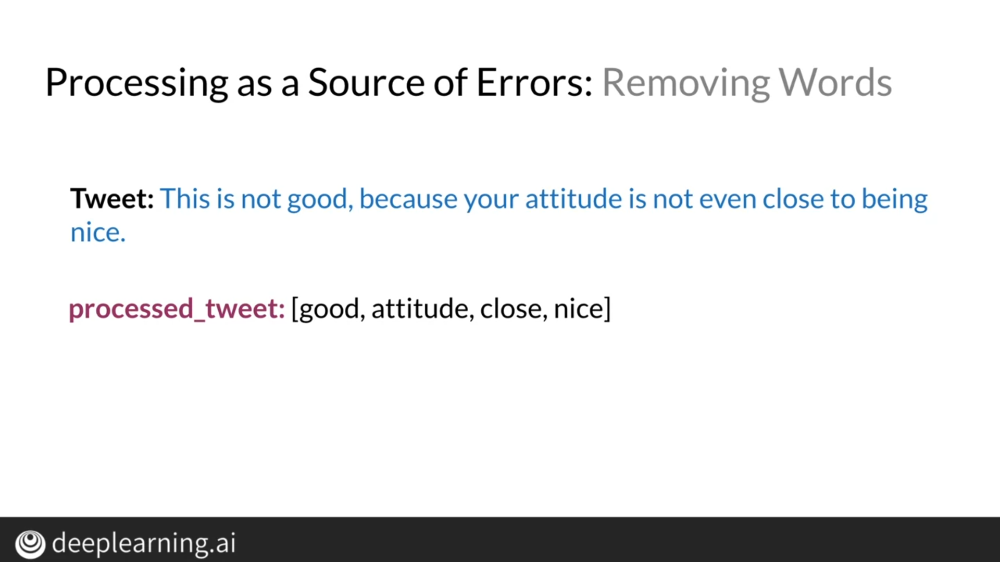

# Course: Natural Language Processing with Classification and Vector Spaces

## Week1: Sentiment Analysis with Logistic Regression

## Logistic Regression
### Supervised Machine learning

<!--  -->
### Vocabulary & Feature Extraction

### Negative and Positive Frequencies

### Feature Extraction with Frequencies

### Preprocessing
- Eliminate stop words and punctuation
- Handles and URLs
- Stemming and lowercasing
  
### Logistic Regression: Training

### Logistic Regression: Testing

### Logistic Regression: Cost Function

## Week2: Naive Bayes
 

### Bayes’ Rule

### Naïve Bayes Introduction

### Laplacian Smoothing

### Log Likelihood

### Training Naïve Bayes

### Testing Naïve Bayes

### Applications of Naïve Bayes

### Error Analysis

