# Course2: Natural Language Processing with Probabilistic Models
## Week1: Autocorrect and Dynamic Programming
### Autocorrect

### Minimum edit distance

## Week2: Part of Speech Tagging and Hidden Markov Models
### Markov Chains

### The Viterbi Algorithm

### Viterbi: Initialization

## Week3: Autocomplete and Language Models
### N-Grams
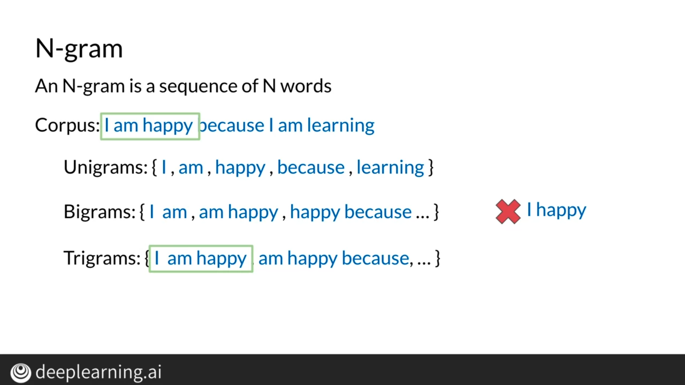
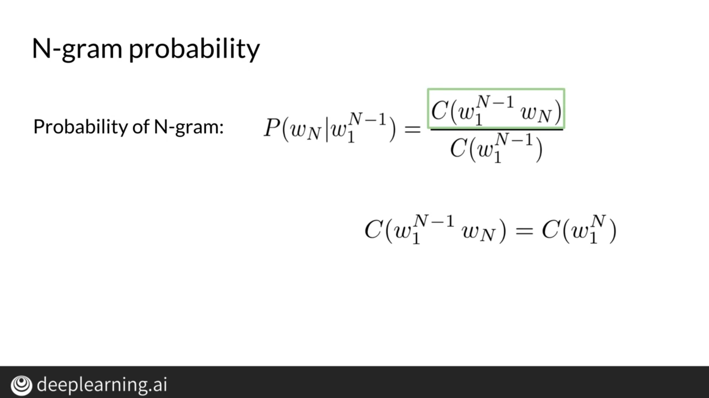
### Sequence Probabilities
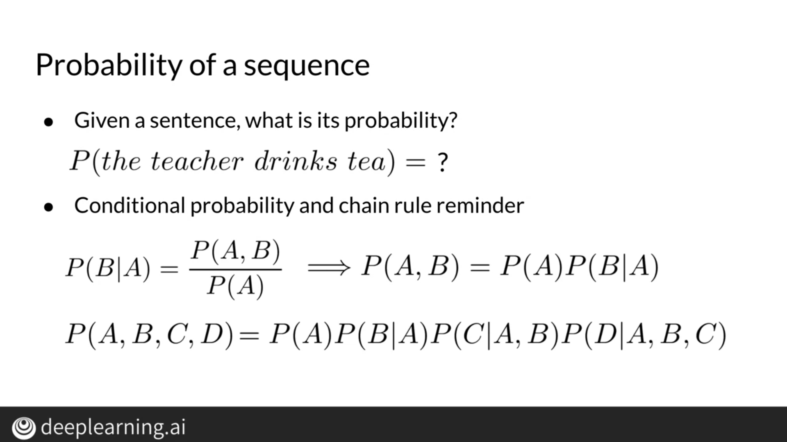
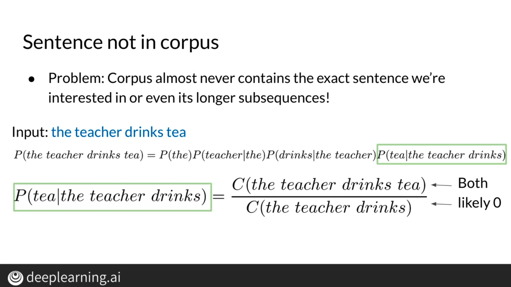
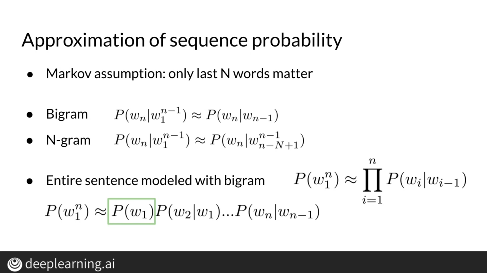
### Starting and Ending Sentences

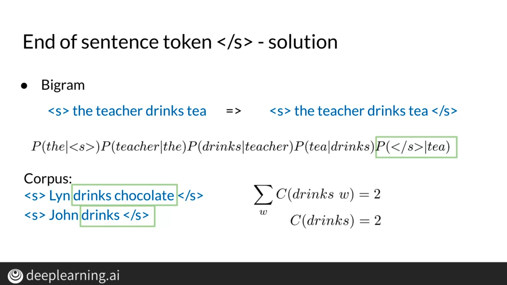
### The N-gram Language Model
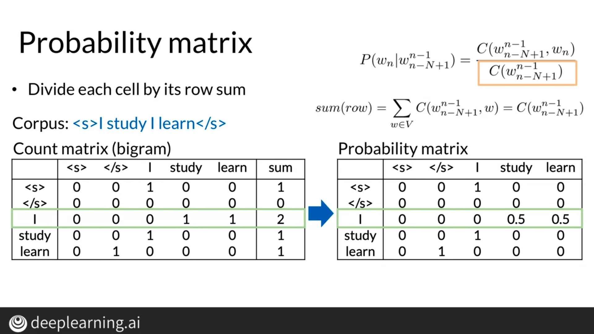

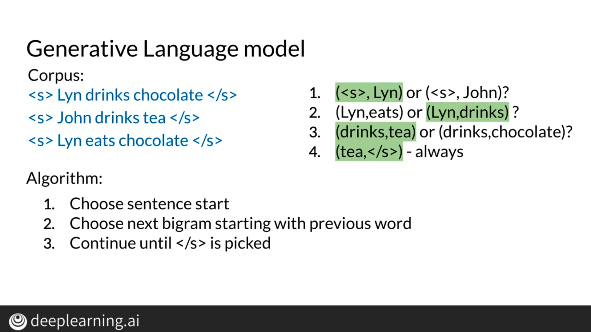
### Language Model Evaluation
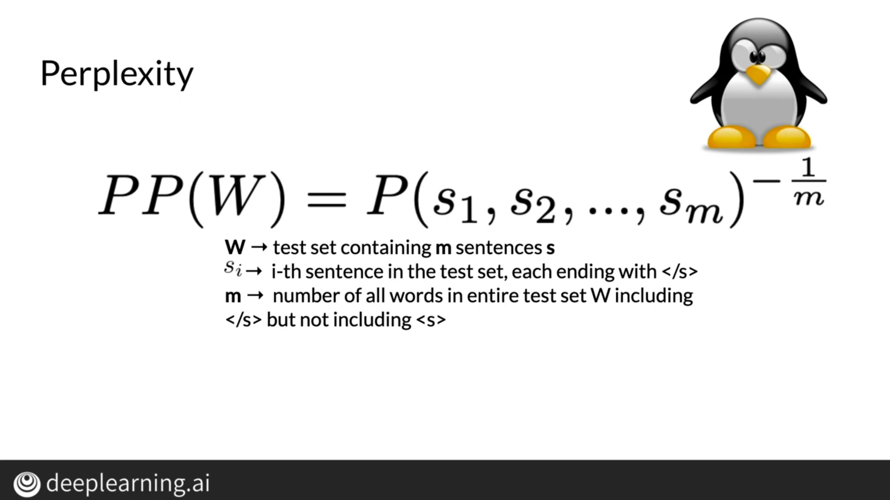
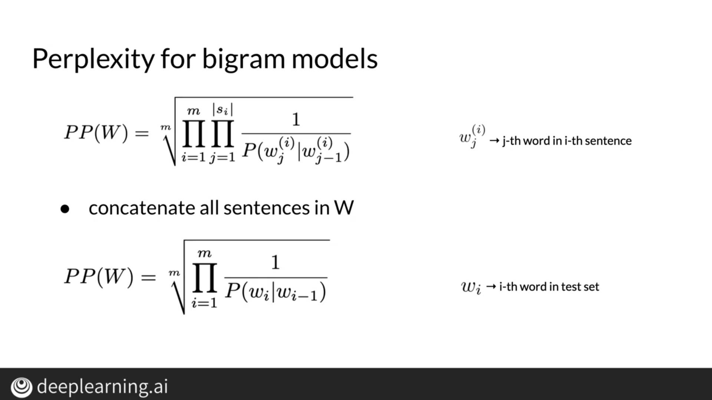
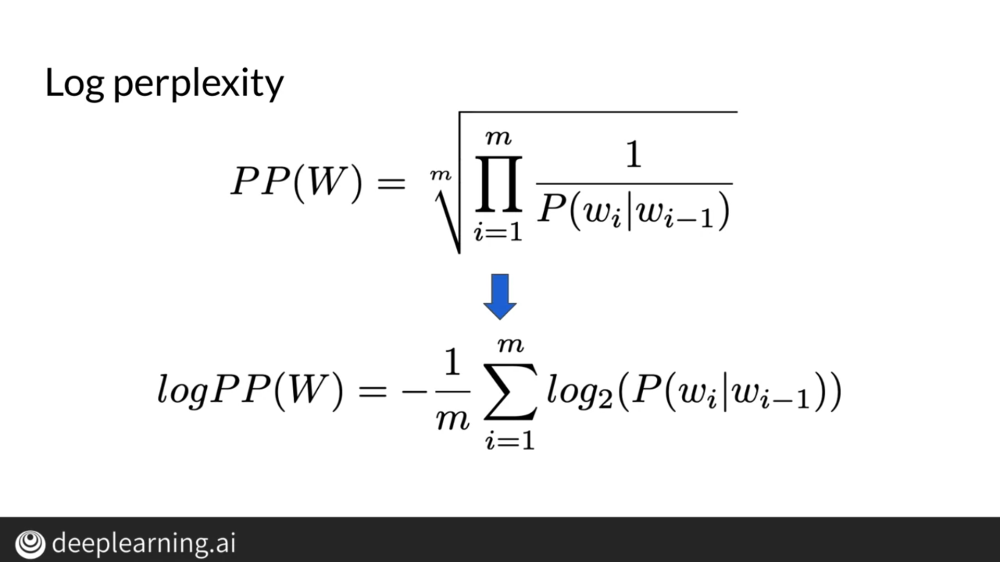
### Out of Vocabulary Words
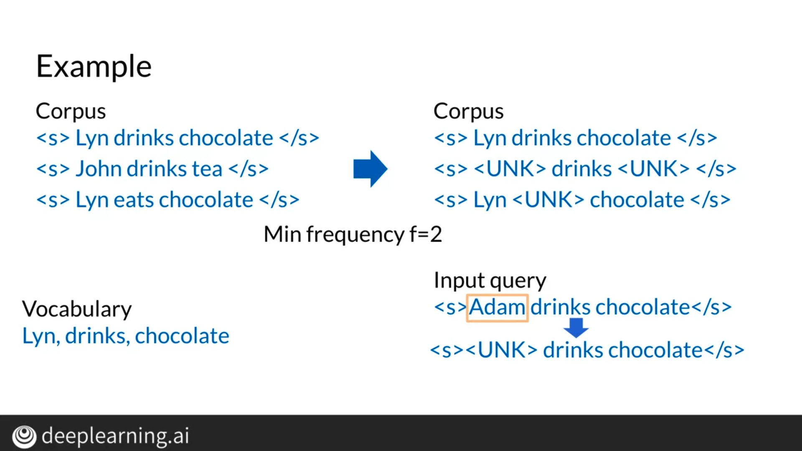
### Smoothing
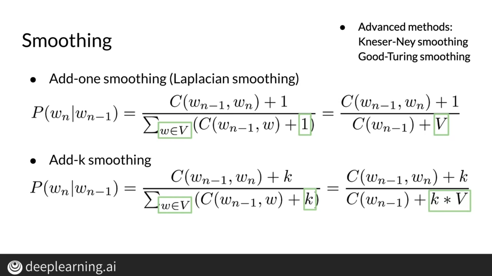
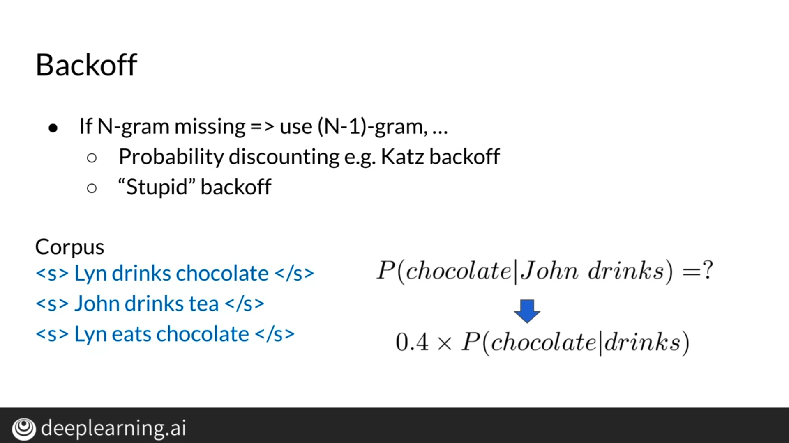
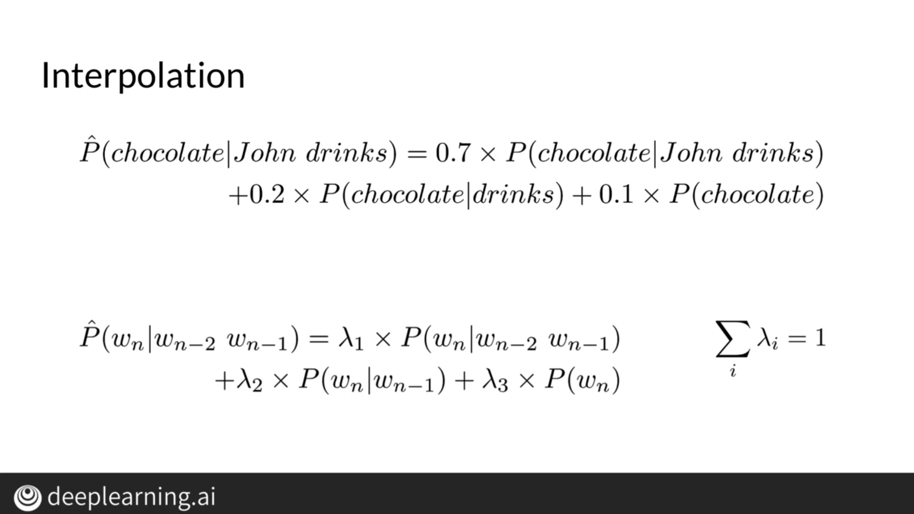