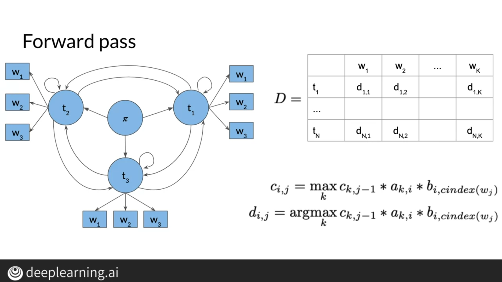

# Course2: Natural Language Processing with Probabilistic Models
## Week1: Autocorrect and Dynamic Programming
### Autocorrect

### Minimum edit distance

## Week2: Part of Speech Tagging and Hidden Markov Models
### Markov Chains

### The Viterbi Algorithm

### Viterbi: Initialization

