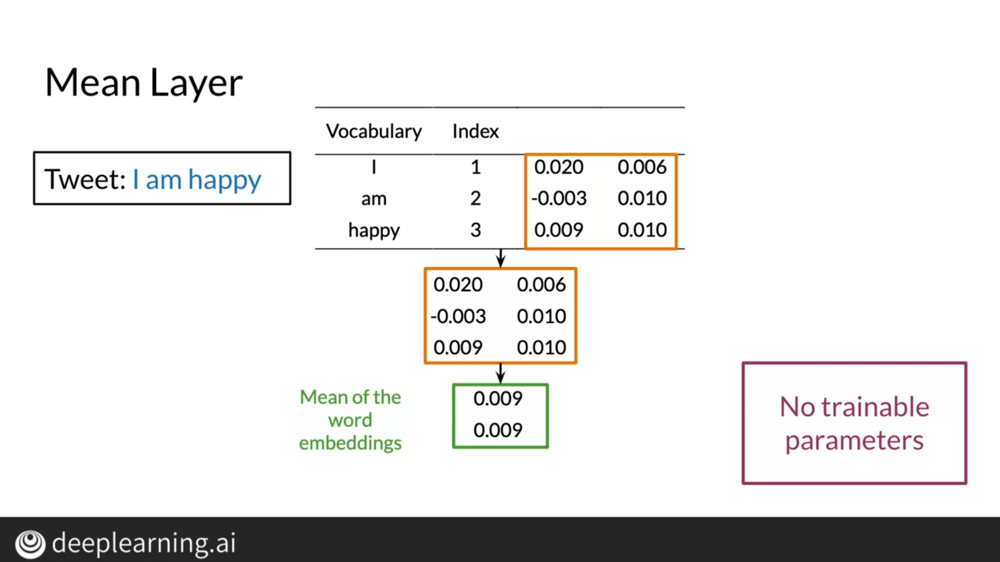
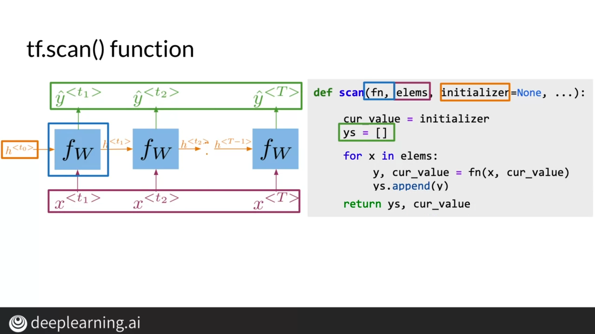
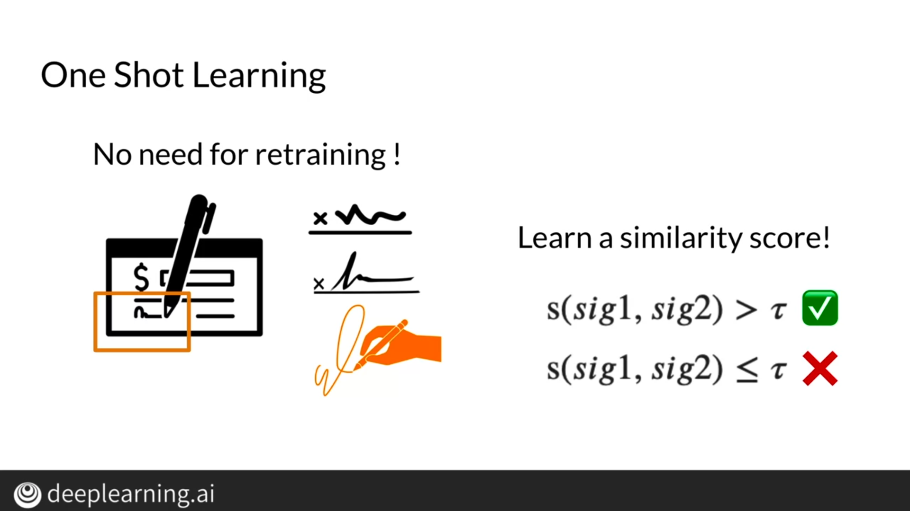

# Course3: Natural Language Processing with Sequence Models
## Week1: Neural Networks for Sentiment Analysis
### Trax: Neural Networks

### Classes and Subclasses

### Serial Layer

## Week2: Recurrent Neural Networks for Language Modeling
### Traditional Language models

### RNN

### Cost Function for RNNs

### Gated Recurrent Units

### Deep and Bi-directional RNNs 

## Week3: LSTMs and Named Entity Recognition
### RNNs and Vanishing Gradients

### Introduction to LSTMs

### Introduction to Named Entity Recognition

### Computing Accuracy

## Week4: Siamese Networks

### Cost Function

### Triplets

### Computing The Cost

### One Shot Learning

