# Course4: Natural Language Processing with Attention Models
## Week1: Neural Machine Translation
### Seq2seq
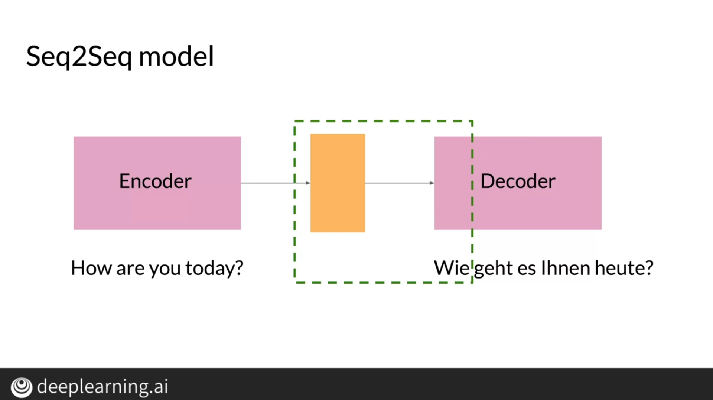
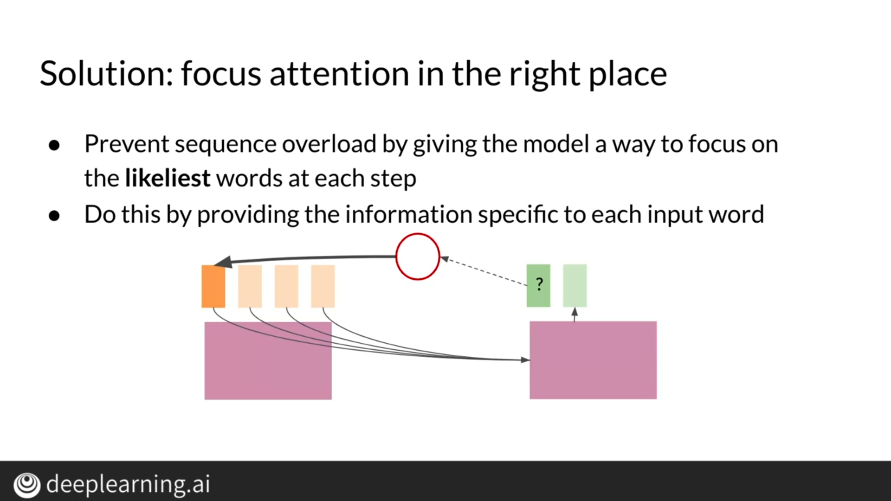
### Attention

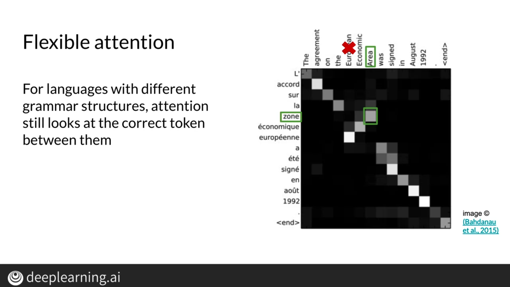
### Training an NMT with Attention
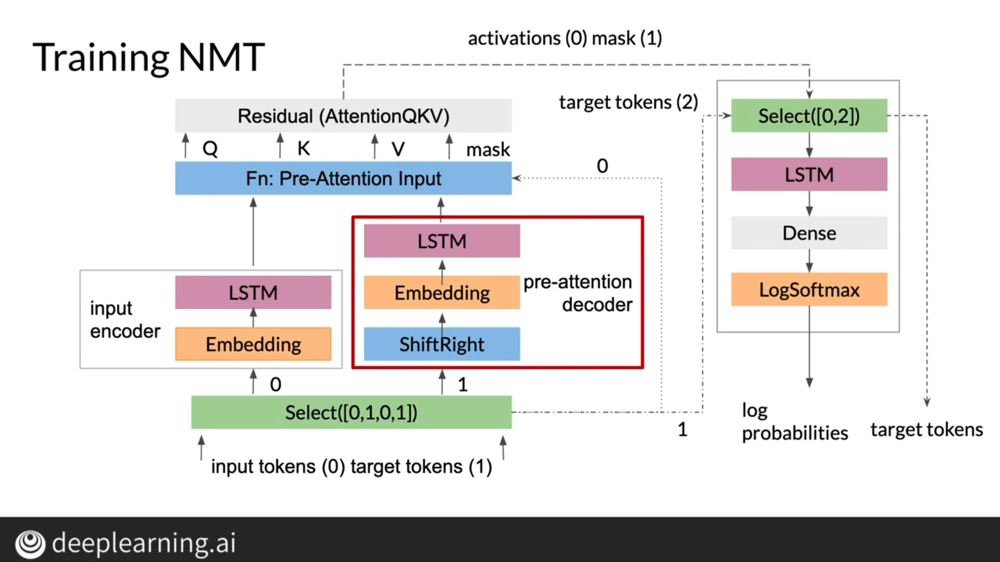
### Evaluation for Machine Translation
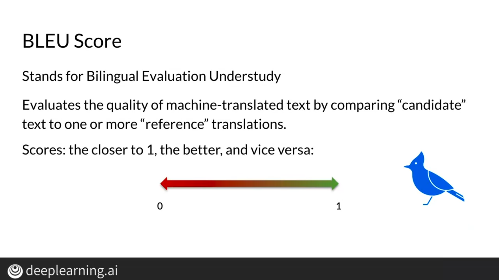
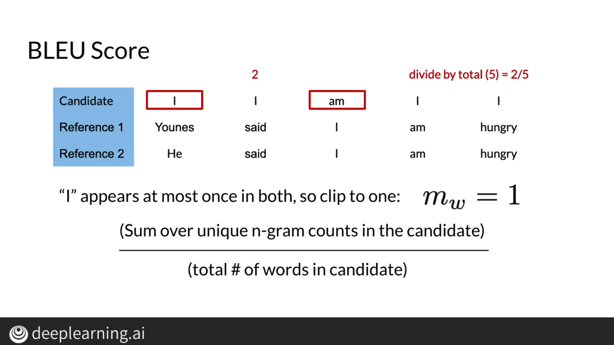

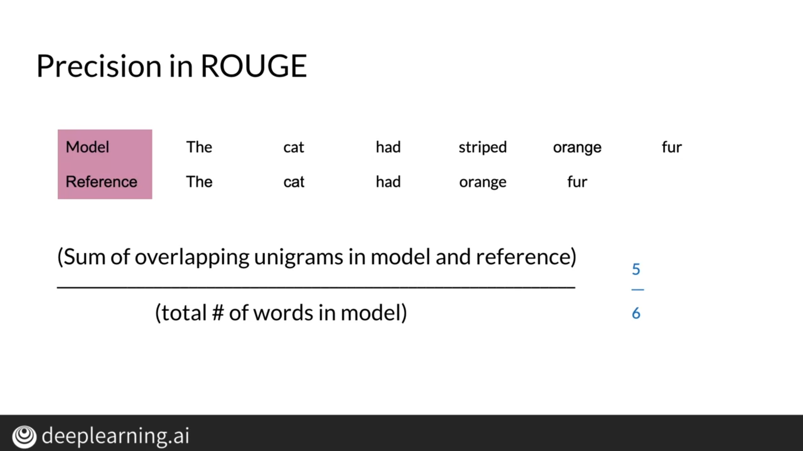
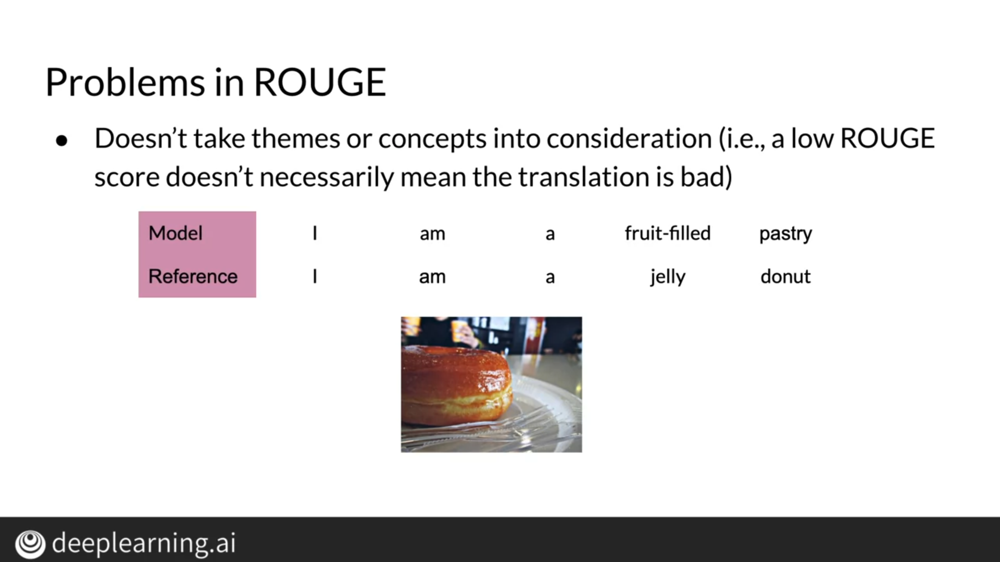
### Sampling and Decoding

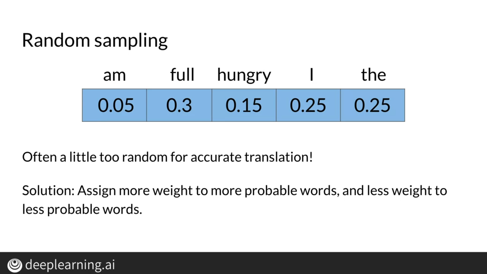
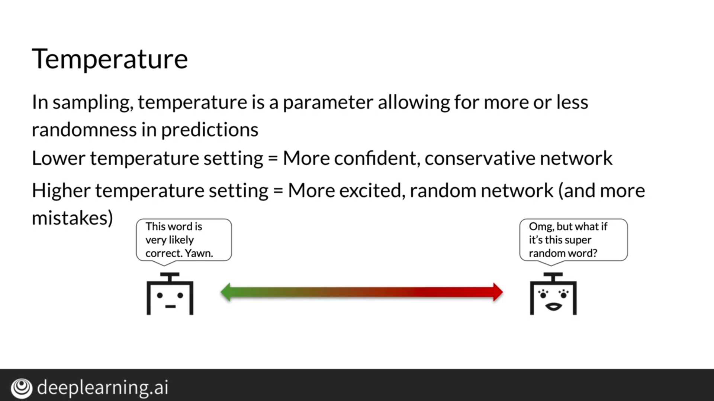
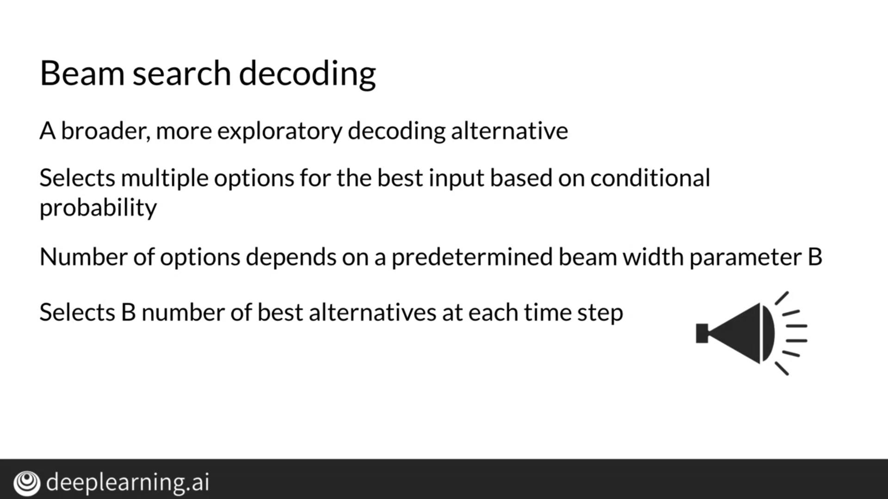
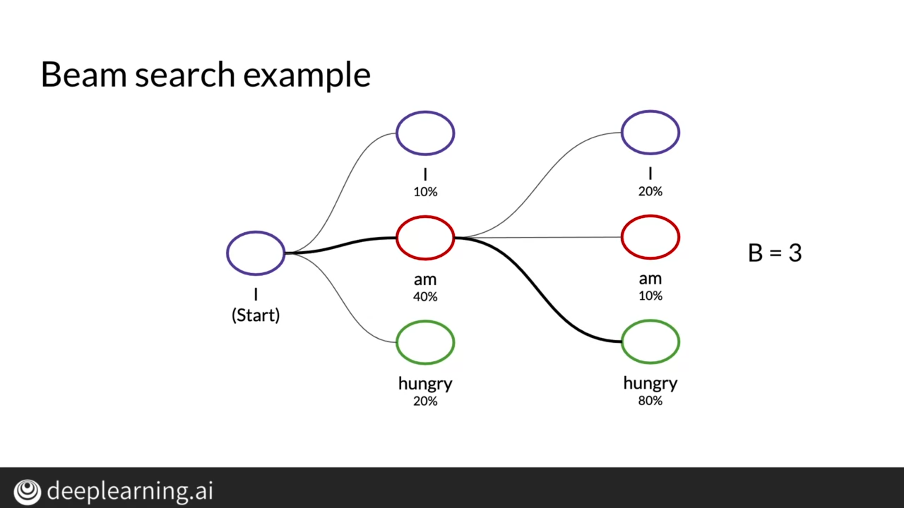

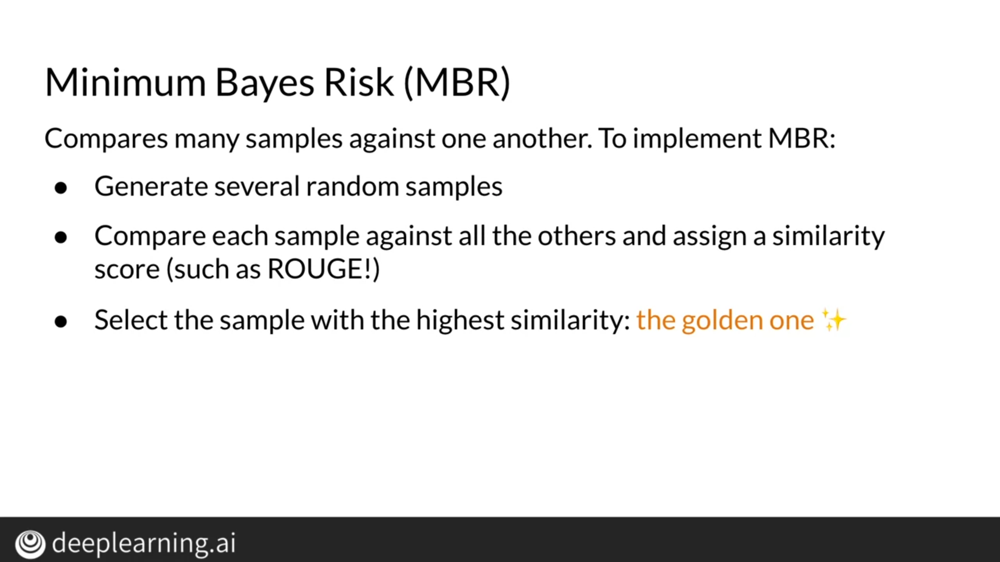
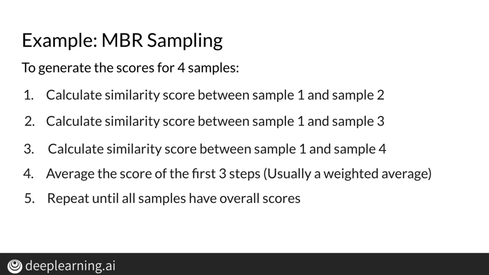
