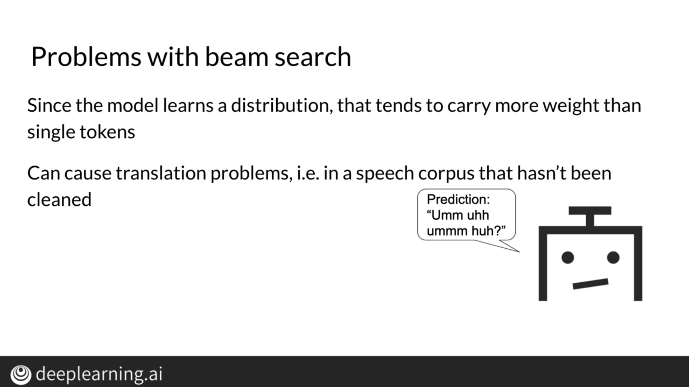

# Course4: Natural Language Processing with Attention Models
## Week1: Neural Machine Translation
### Seq2seq

### Attention

### Training an NMT with Attention

### Evaluation for Machine Translation

### Sampling and Decoding

